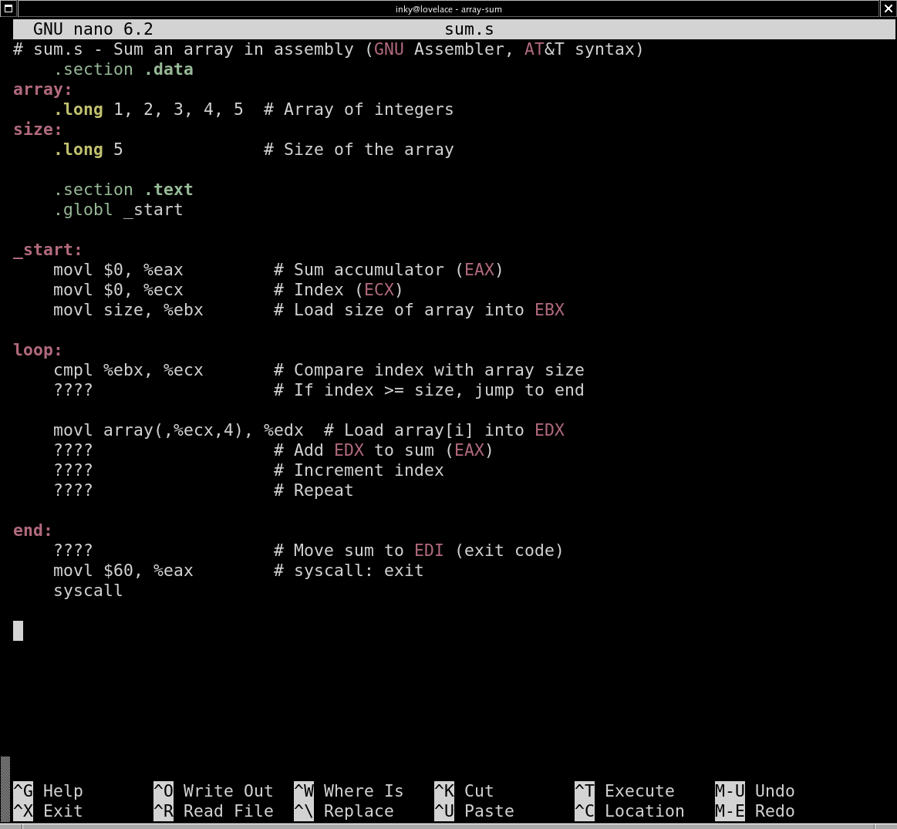

so you need to calculate sum of the array

how to build?
```
as -o sum.o sum.s
ld -o sum sum.o
```

how to run?
```
./sum
```
how to check the result? exit status:
```
echo $?
```


create a makefile which will have commands to build.

now, in order to do that you need to know some instructions.

some basic knowledge again: register are written with % sign: %eax, %rax, %ax...
constant integers with $ sign: move $5, %eax

(%eax) means that eax stores a pointer to the memory location, so dereference.

you already know `mov`, but there are variations: `movb`, `movw`, movl`

depending on which data you work, your instruction takes different suffix.

addb or movb wants 8 bit register or will perceive memory location as something that contains 8 bits of data.

movb, movw, movl, movq → Move a byte, word, doubleword, or quadword

addb, addw, addl, addq → Add a byte, word, doubleword, or quadword

addl src, dst  → dst = dst + src

there are also instructions incb, incw, incl, decb, decw, decl...

to compare you can use cmpb, cmpw, cmpl, cmpq

cmpl src, dst  → Compare dst - src

result of comparison affects CPU flags register. one of the bits there will indicate something:

SF (Sign Flag): Set if the result of an operation is negative.

ZF (Zero Flag): Set if the result of an operation is zero.

OF (Overflow Flag): Set if an arithmetic overflow occurs (e.g., when adding two positive numbers results in a negative value in signed arithmetic).

then after you compared, you can use one of these functions to test for equality, if less ,if less and equal, etc:

jge label  → Jump if greater or equal (SF == OF)

jg label  → Jump if greater (ZF == 0 and SF == OF)

jl label  → Jump if less (SF != OF)

jle label  → Jump if less or equal (ZF == 1 or SF != OF)

je label  → Jump if equal (ZF == 1)

jne label  → Jump if not equal (ZF == 0)

those are the instructions you need to know.

now, this is your source code:



type it by using your text editor (no need to type comments) and replace question marks with instructions. then build, test.

have fun!


